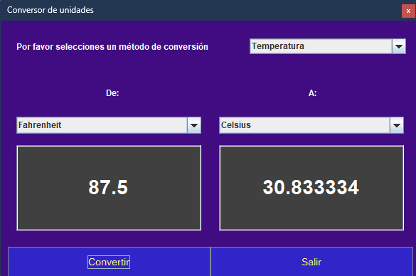

# Challenge Conversor de Unidades

___

El reto consite en programar un conversor de divisas

> + Dolar
> + Euros
> + Libra esterlina
> + Yen japonés
> + Won surcoreano

Adicionalmente, se debe de permitir la converisón hacia la monea de mi país (Colombia), pero se agregaron un par de modenas más.

Para esto se realizó conexión con la API de [CurrencyAPI](https://currencyapi.com/)

Poteriormente se adicionó diferentes unidades de medida como lo son:

+ Temperatura
+ Peso
+ Distancia
+ Área

## Screenshots

___

> 
> 
> 
> 

___

Arley Yamid Taborda Taborda

___